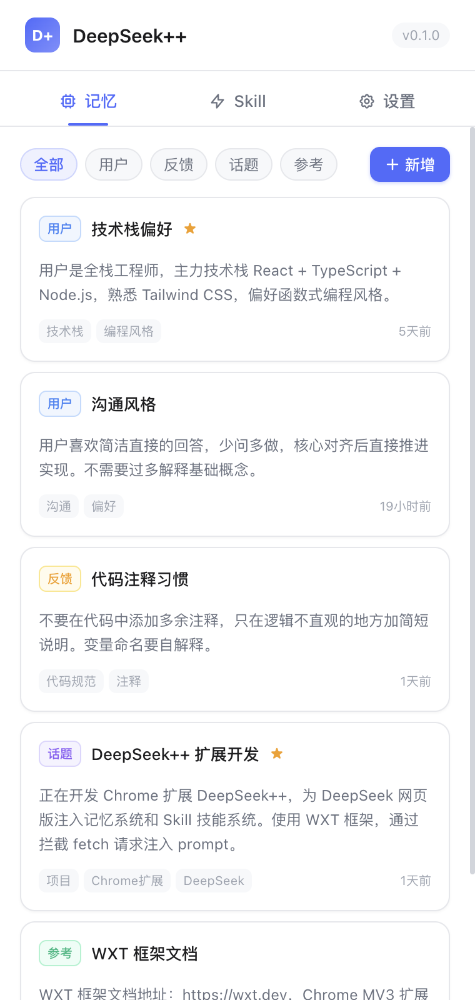
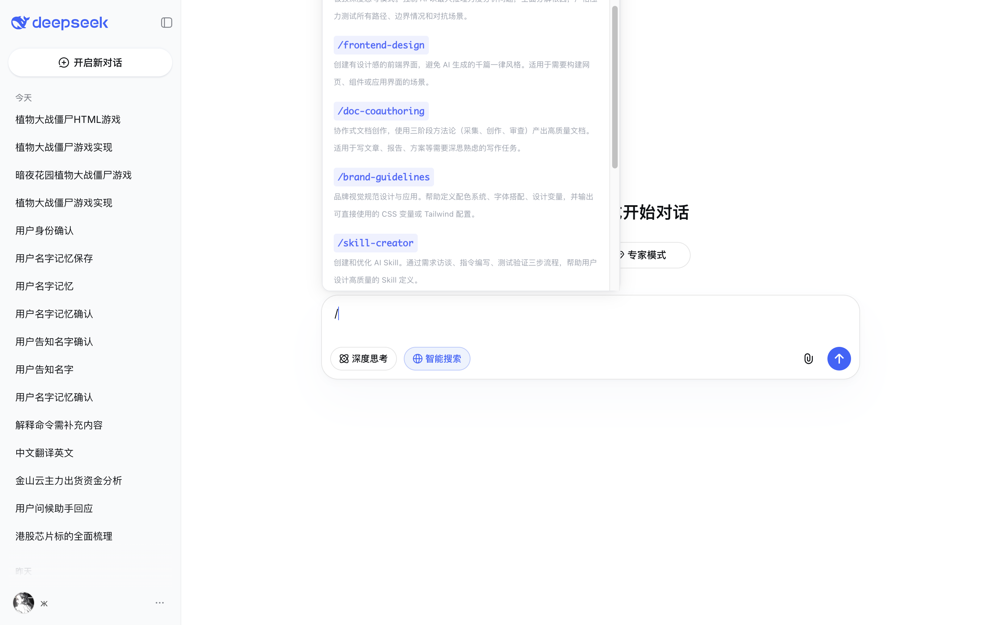
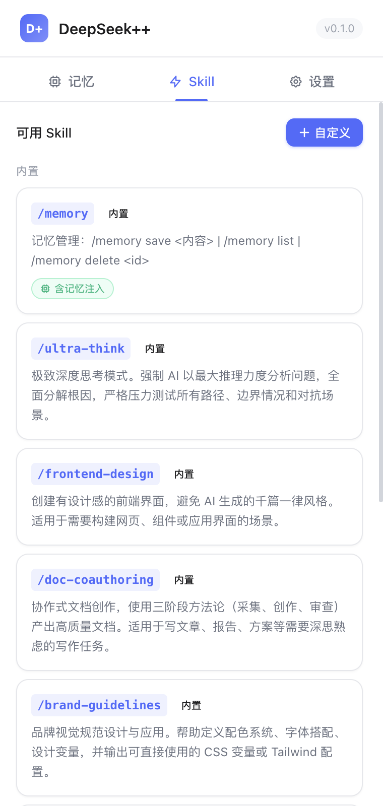

<p align="center">
  
</p>

<h1 align="center">DeepSeek++</h1>

<p align="center">
  <strong>DeepSeek browser extension for a bilingual AI agent workspace with memory, projects, Skills, MCP tools, multimodal media, browser control, saved snippets, artifact downloads, conversation export, and automation.</strong>
</p>

<p align="center">
  <a href="https://github.com/zhu1090093659/deepseek-pp/stargazers"></a>
  <a href="https://github.com/zhu1090093659/deepseek-pp/watchers"></a>
  <a href="https://github.com/zhu1090093659/deepseek-pp/network/members"></a>
  <a href="https://github.com/zhu1090093659/deepseek-pp/issues"></a>
</p>

<p align="center">
  <a href="https://github.com/zhu1090093659/deepseek-pp/releases"></a>
  <a href="https://chromewebstore.google.com/detail/deepseek++/kdmpkkahkhdmdhfkdihkopikgcocbpbf?hl=zh-CN"></a>
  <a href="#license"></a>
  <a href="https://chat.deepseek.com"></a>
  <a href="https://linux.do"></a>
</p>

<p align="center">
  <a href="README.md">Chinese README</a> ·
  <a href="#product-positioning">Product Positioning</a> ·
  <a href="#feature-overview">Feature Overview</a> ·
  <a href="#use-cases">Use Cases</a> ·
  <a href="#installation">Installation</a> ·
  <a href="#105-release-highlights">1.0.5 Highlights</a>
</p>

## Product Positioning

DeepSeek++ is an open-source browser extension for [DeepSeek Web](https://chat.deepseek.com), with support for Chrome, Edge, and Firefox. It turns DeepSeek Web into an AI agent workspace where users can run English or Simplified Chinese UI, MCP tools, image/video multimodal analysis, long-term memory, Skills, system prompt presets, web search, web fetch, conversation export, and scheduled automation in the same browser workflow.

In plain terms, it is a DeepSeek Chrome extension, DeepSeek MCP tools extension, DeepSeek memory plugin, DeepSeek conversation export tool, and AI agent browser extension for DeepSeek Web.

Language can follow the browser or be set to English or Simplified Chinese. DeepSeek++ keeps the side panel, context menus, tool results, built-in Skill behavior, and continuation prompts in the selected language while preserving user-authored memories, presets, custom Skills, automation tasks, and sync data as written.

## Table of Contents

- [Product Positioning](#product-positioning)
- [Feature Overview](#feature-overview)
- [Use Cases](#use-cases)
- [Core Features](#core-features)
- [1.0.5 Release Highlights](#105-release-highlights)
- [Installation](#installation)
- [Friendly Links](#friendly-links)

## Feature Overview

| Need | What DeepSeek++ provides |
|------|--------------------------|
| AI agent browser extension | Turns DeepSeek Web into a browser-based workspace that can continue tasks, call tools, reuse memory, and schedule automation. |
| DeepSeek browser extension / DeepSeek Chrome extension | Adds side-panel chat, right-click text sending, tool-result rendering, and Chrome / Edge / Firefox support for DeepSeek Web. |
| Multilingual DeepSeek extension | Switches between English and Simplified Chinese, keeping UI, built-in tool descriptions, and model continuation behavior in the same language. |
| DeepSeek MCP tools | Lets you manage MCP services, tool permissions, and execution status in the side panel, then sends tool results back into the same conversation. |
| DeepSeek multimodal media | Attach images in Vision mode from side-panel web chat; after installing the Multimodal Native Host, also attach images or videos in the DeepSeek input box so DeepSeek++ can analyze the media first and continue the conversation with the results. |
| DeepSeek browser control | Lets DeepSeek++ operate a user-selected browser tab after the user enables the feature and chooses the target. |
| DeepSeek memory | Automatically saves, filters, and injects long-term memory so different conversations can reuse user preferences, project context, and common facts. |
| DeepSeek coding agent | File read/write/edit, code search with ripgrep, symbol lookup across 6+ languages, and full git workflow (status, diff, commit, branch, push). Requires Shell and Code Index native hosts. |
| DeepSeek file tools | `file_read` (line offset), `file_write` (auto-backup), `file_edit` (multi-hunk), `file_list` (recursive), `file_search` (ripgrep-first) via Shell native host. |
| DeepSeek code search | `code_search`, `code_symbol`, `code_structure`, `code_glob`, `code_batch_read` via Code Index native host with 30s index cache. |
| DeepSeek git tools | `git_status`, `git_diff`, `git_log`, `git_commit`, `git_branch`, `git_push` with structured output and auto repo root detection. |
| DeepSeek Skills / `/skill` workflows | Switches quickly between built-in, custom, and GitHub-imported Skills for expert modes and task templates. |
| DeepSeek project context | Groups project instructions, project memories, and related DeepSeek conversations so matching chats get the right context automatically. |
| DeepSeek artifact downloads | Creates downloadable single files or project bundles for scripts, Markdown, JSON, HTML, and small project structures. |
| DeepSeek conversation export | Exports the current DeepSeek conversation from the reply action row with selectable HTML, Markdown, PDF, and image-manifest outputs, including attachment references and metadata. |
| DeepSeek saved snippets | Saves snippets, bookmarks, and reusable prompts that can be searched, inserted into chat, and exported as Markdown or JSON. |
| DeepSeek prompt controls | Controls memory, system prompt, preset cadence, and response language for different tasks. |
| DeepSeek automation | Runs fixed tasks in dedicated DeepSeek conversations with manual start, scheduled triggers, status tracking, and manual stop. |
| DeepSeek web search / web fetch | Searches the web or reads specified pages when current information or source material is needed, then continues to the final answer. |

## Use Cases

- Turn DeepSeek Web into an AI agent workspace with tool execution, MCP, memory, and automation.
- Use DeepSeek++ in an English or Simplified Chinese workflow with matching UI, tool guidance, and model continuation prompts.
- Use DeepSeek side-panel chat, selected-text actions, and reusable prompt scenarios directly in Chrome, Edge, or Firefox.
- Add images or videos to a DeepSeek conversation so the model can continue explanations, summaries, comparisons, or document tasks from the media analysis.
- Let AI work in a user-selected Chrome or Edge tab while keeping explicit enable, target switching, and detach controls.
- Save project context, personal preferences, common workflows, and document-processing routines as long-term memory and reusable Skills.
- Back up your own DeepSeek conversation history locally as readable files for archive, migration, or later search.
- Let DeepSeek handle tasks that require multi-step tool execution, web search, page reading, or scheduled follow-up.

## Core Features

### Side-Panel Chat

- **Optional chat entry** - After it is enabled in settings, the side panel shows a Chat page where you can message DeepSeek directly.
- **Right-click selected text** - Select text and send it to the side-panel chat for quick explanation, summary, or rewriting.
- **Right-click scenarios** - Configure reusable scenario templates that wrap selected text in fixed prompts.
- **Official API Key** - After a Key is configured, side-panel chat and right-click scenarios can work on normal web pages; without a Key, right-click scenarios stay limited to DeepSeek Web.
- **Web model mode** - When using web-login chat, switch between Default, Expert, and Vision modes.
- **Vision image attachments** - In Vision mode, choose or paste images explicitly; images enter the DeepSeek conversation only when you send that message.
- **Independent new conversations** - Create new side-panel conversations to avoid mixing with the current page conversation.
- **Streaming display** - Responses render continuously in the side panel. If login is missing, the extension prompts you to return to DeepSeek and sign in.

### Multilingual Experience

- **Language selection** - Follow the browser, or choose English or Simplified Chinese.
- **Consistent runtime language** - The side panel, context menus, tool results, built-in tool descriptions, and continuation prompts follow the selected language.
- **Matching model behavior** - Built-in Skills, tool-call guidance, web-search prompts, and long-task continuation prompts use the current language.
- **User content stays unchanged** - User-created memories, presets, custom Skills, automation prompts, MCP settings, and sync data are not translated or rewritten when the language changes.

### Project Context and Downloadable Artifacts

- **Project context** - Maintain project names, descriptions, and instructions in the side panel, then add related DeepSeek conversations to each project.
- **Project-aware chats** - Conversations assigned to a project automatically receive that project's instructions and project memories.
- **Project memory management** - Add, edit, pin, or delete memories that belong only to the selected project.
- **Single-file artifacts** - Ask DeepSeek++ to create downloadable scripts, Markdown, JSON, HTML, or other text files.
- **Project bundles** - Download multi-file results as a bundle for prototypes, small tools, or documentation sets.
- **Local-first flow** - Project context, project memories, and generated artifacts are maintained and downloaded by the user without a DeepSeek++ backend.

### Native-Feeling Tool Calls

- **Automatic detection and execution** - When the model asks to call a tool, the extension detects and runs it without requiring manual copying.
- **Clean visible output** - Technical call details stay hidden from the page; users see concise execution results.
- **Native-style rendering** - Tool results appear as collapsible blocks such as "Executed tools (2)" with itemized results.
- **Multiple tool calls per response** - A single answer can run multiple tool calls, which is useful for saving independent facts as separate memories.
- **Restored after refresh** - Tool execution records can be restored after the conversation page is refreshed.
- **Output speed indicator** - While a response is streaming, the input area shows live `tok/s` so you can tell whether the conversation is still producing output.

<p align="center">
  
</p>

### Conversation Export

- **Current conversation export** - Export the current DeepSeek conversation from the same row as the official copy and share actions.
- **Selectable formats** - HTML is selected by default, with Markdown and PDF files available when needed.
- **Readable mode** - Extension-internal prompt and tool-call markup are hidden by default so exports are easier to read and search.
- **Attachment manifest** - Includes file references, names, sizes, statuses, and message links. File body export stays disabled until the download path is verified.
- **Image manifest** - Export a separate image attachment manifest for conversations that include screenshots, charts, or image files.
- **Single-message export** - Save an individual page message as Markdown when you only need one answer excerpt.
- **Local saves** - Export files are saved through the browser's local download flow. DeepSeek++ does not operate a backend for collecting export data.

### Saved Items and Conversation Organization

- **Saved snippets and bookmarks** - Save reusable prompts, answer fragments, web leads, or reference notes in the side panel.
- **Fast insertion** - Insert a saved item into side-panel chat when reusing a fixed instruction or workflow.
- **Search and tags** - Search saved items by text or tags; tag DeepSeek history items and filter by title or tag.
- **Bulk export** - Export saved items as Markdown or JSON for migration, backup, or review.
- **Code block downloads** - Save code blocks from the DeepSeek page as local files with the matching file type.
- **What's new panel** - Settings can show a local version summary that users can dismiss.

### Built-In Web Tools

---

### Coding Capabilities

DeepSeek++ 1.0.5+ adds complete file, code, and git tooling with a coding-optimized agent loop, enabling coding workflows similar to Claude Code.

#### File System Tools

5 file operations integrated into the Shell native host:

- **`file_read`** — Read file content with line offset/limit and binary detection
- **`file_write`** — Write file with auto-directory-creation and pre-overwrite backup to `.deepseek-pp/backups/`
- **`file_edit`** — Search-and-replace editing with multi-hunk support and dry-run mode
- **`file_list`** — Recursive directory listing with glob filtering, skips `.git` and `node_modules`
- **`file_search`** — Full-text regex search with ripgrep priority and Node.js fallback

Install the Shell native host:

```bash
npx deepseek-pp-shell-host install --browser chrome --extension-id <extension-id>
```

#### Code Understanding Tools

An independent Code Index native host provides code search and structure analysis:

- **`code_search`** — Full-text regex search (ripgrep-first) with context lines and glob filters
- **`code_symbol`** — Find symbol definitions (function, class, interface) across **6+ languages**
- **`code_structure`** — File outline: imports, exports, classes, functions, variables with line numbers
- **`code_glob`** — Glob file matching with `.gitignore` awareness and 30s index cache
- **`code_batch_read`** — Read multiple files in a single call (up to 20 files, 512KB total)

Install the Code Index native host:

```bash
npx deepseek-pp-code-index install --browser chrome --extension-id <extension-id>
```

#### Git Workflow Tools

6 git tools integrated into the Shell native host:

- **`git_status`** — Structured status output (staged/modified/untracked/conflicted) with auto repo root detection
- **`git_diff`** — Diff display with staged/unstaged control and context line count
- **`git_log`** — Structured commit history with branch filtering
- **`git_commit`** — Stage all changes and create a commit
- **`git_branch`** — List, create, and switch branches
- **`git_push`** — Push to remote repository

Recommended workflow:

```
git_status → file_read → file_edit × N → python_exec(verify) → git_diff → git_commit
```

#### Coding Agent Optimization

When coding tasks are detected, DeepSeek++ activates a coding-optimized agent loop:

- **Read before modify** — Auto-read file state before every edit
- **Plan-Execute-Verify** — Output `<edit_plan>` structured plan before execution
- **Readonly parallel** — `code_search` + `file_list` + `git_status` execute concurrently
- **Post-edit verification** — Auto-trigger compile/syntax check after `file_edit`
- **Context budget management** — Auto-prune old successful results by priority to avoid 128K context limit
- **Scenario-aware filtering** — File/code/git tools are only injected in coding mode

#### Tool Inventory

| Group | Tools | Typical Use |
|-------|-------|-------------|
| File System | 5 | Read, write, edit, list, search files |
| Code Understanding | 5 | Full-text search, symbols, structure, glob, batch read |
| Git | 6 | Status, diff, log, commit, branch, push |
| Memory | 3 | Save, update, delete long-term memories |
| Web | 2 | Search and fetch page content |
| Shell | 9 | Command execution, Python, persistent sessions |
| Browser Control | 18 | Navigate, click, fill, snapshot |
| Artifact | 2 | Single-file and bundle artifacts |
| Sandbox | 1 | In-browser code execution |
| MCP | Dynamic | Third-party tools |

#### Resources

- [Usage Manual](USAGE.md) — Complete coding capability guide
- Shell native host at `packages/shell-host/native/shell-mcp-host.mjs`
- Code Index native host at `packages/code-index-host/native/code-index-host.mjs`

- **Web search** - The model can call `web_search` when it needs current information, fact checking, or source links.
- **Web fetch** - The model can call `web_fetch` to read visible text from a user-provided page for further summary or analysis.
- **Automatic continuation** - After search or fetch completes, the result returns to the same conversation and the model continues to the final answer.
- **Tool toggles** - Built-in web tools can be enabled or disabled individually from the Tools page in the side panel.
- **Permission management** - Page fetching can request per-site permission from the side panel, while search uses built-in permissions for common search sources.
- **Diagnostics** - The side panel includes search diagnostics to confirm current network and permission status.

### Agentic Continuation

- **Keep progressing through tasks** - Like Claude Code or Codex, the model can inspect tool results and decide the next step instead of stopping after one tool call.
- **Step-by-step continuation** - MCP tool results are sent back into the same conversation until the task is done or no more tools are needed.
- **Pacing control** - Multi-step continuation leaves a short interval between requests to reduce interruptions during long tasks.
- **Step blocks** - Continuous execution is displayed by step; completed steps collapse automatically so long tasks do not bury the main answer.
- **Refresh recovery** - Recent tool execution progress and final status can be restored after the page is refreshed.
- **Manual stop** - Long-running continuation can be stopped manually.

<p align="center">
  
</p>

### Browser Control

- **Opt-in control** - Enable Browser Control from Capabilities > Browser, then select a target tab before browser tools are added to new conversations.
- **Visible web actions** - Supports navigation, click, hover, fill, key press, waiting for page content, dialog handling, and file attachment workflows.
- **Text snapshots** - The model receives page structure and visible-text summaries, not screenshots; node and text budgets can be adjusted.
- **Target control** - Review the attached state, refresh target tabs, switch the controlled tab, or detach Browser Control at any time.
- **Platform boundary** - Browser Control is available only on Chrome / Edge environments that support the required browser APIs, and disabled control does not inject browser tools into new conversations.

### Interactive Tools and Prompt Controls

- **Sandbox approvals** - Code execution that needs explicit permission shows a confirmation card before it continues.
- **Skill drafts** - AI can help draft a Skill, but the user reviews, edits, and confirms it before saving.
- **Memory import** - Import memory from another AI workflow with preview and per-item accept/reject controls.
- **Saved-item reuse** - Snippets and bookmarks can be reused as prompt material across conversations.
- **Voice input and read-aloud** - Use voice input and response read-aloud when the browser supports it; unsupported platforms show a clear status.
- **Prompt switches** - Disable memory, system prompt, or preset injection per task, or force a response language.

### Floating Pet

- **State-aware feedback** - DeepSeek pages can show the DeepSeek whale pet, which reacts to thinking, streaming, tool execution, success, and failure states.
- **Speech bubble** - The pet shows short status lines and rotates them during long thinking, streaming, or tool-execution periods.
- **Adjustable position** - Pin it to the lower-left or lower-right corner, or drag it to a custom position.
- **Adjustable appearance** - Configure size, opacity, and floating animation in settings.
- **Local persistence** - The on/off state, position, and appearance are stored locally in the browser and survive refreshes.

<p align="center">
  
</p>

### MCP Tool System

- **Flexible connections** - Add remote or local MCP services for browser-side tools, local commands, or team tools.
- **Automatic execution by default** - Newly added MCP services run automatically by default, with per-service and per-tool switches for manual execution.
- **Permission and status management** - Authorize tools, test connections, refresh tool lists, and inspect status from the side panel.
- **Results return automatically** - Tool results return to the same conversation so the model can keep generating.
- **Agentic continuation support** - MCP tool results can feed back into the original conversation, supporting multi-step long-running tasks.
- **Built-in multimodal preset** - Create the `Multimodal` preset so DeepSeek can analyze multiple images through OpenAI and videos through Gemini.
- **Input-box media attachments** - After the Multimodal preset is installed and enabled, add images or videos from the DeepSeek input box and continue the message with the analysis results.
- **User-controlled boundary** - OpenAI / Gemini keys, models, and request URLs are configured by the user in Settings. Media files enter multimodal analysis only when the user attaches and sends them.
- **Local security** - MCP configuration and secrets stay in browser-local storage. Sync does not include sensitive MCP data.

<p align="center">
  
</p>

Install the Multimodal Native Host:

```bash
npx deepseek-pp-multimodal-mcp install --browser chrome --extension-id <extension-id>
```

The side-panel MCP page automatically fills in the current extension ID. After installation, configure OpenAI / Gemini keys, models, and request URLs under `Settings` → `Multimodal API`, then enable the `Multimodal` preset, test it, and refresh tools.

When developing from source, you can also use:

```bash
npm run multimodal:install -- --browser chrome --extension-id <extension-id>
```

### OfficeCLI Document Tools

- **Built-in `/officecli` Skill** - A controlled workflow for inspecting, locating issues, validating, and editing `.docx`, `.xlsx`, and `.pptx` files. Disabled by default and enabled manually from the Skills page.
- **Third-party Skill library** - Includes OfficeCLI Skills for DOCX, XLSX, PPTX, Pitch Deck, Academic Paper, Financial Model, Dashboard, Morph PPT, and more.
- **Third-party style library** - Includes the OfficeCLI PPT styles index and style descriptions, with chainable loading such as `/officecli-pptx /officecli-styles ...`.
- **Runs through Shell MCP** - After creating the Shell preset in the side panel, the model can call command-based OfficeCLI through `shell_exec`.
- **Automatic command-line installation** - `deepseek-pp-shell-host` installs the command-based OfficeCLI binary from iOfficeAI/OfficeCLI release assets according to your OS and processor type.
- **Command mode first** - The Skill checks that `officecli --help` exposes scriptable commands such as `view`, `get`, `set`, and `batch`.
- **Rejects hosted quota generation paths** - If the current binary only exposes hosted generation commands such as `new --prompt`, the Skill stops and asks you to switch to the command-based OfficeCLI binary.
- **Real local paths** - Document paths come from the user or from Shell MCP queries. The workflow does not guess placeholder directories.

Install the Shell Native Host:

```bash
npx deepseek-pp-shell-host install --browser chrome --extension-id <extension-id>
```

The side-panel MCP page automatically fills in the current extension ID. This command installs both the Shell Native Host and command-based OfficeCLI. The Shell MCP enables local command execution. After installation, restart the browser, open the MCP page in the side panel, create the Shell preset, then test and refresh tools. Command-based OfficeCLI can continue using scriptable commands such as `create`, `get`, `set`, `view`, `batch`, and `validate` without using hosted `new --prompt` quota.

When developing from source, you can also use:

```bash
npm run shell:install -- --browser chrome --extension-id <extension-id>
```

### Memory System

- **Automatic memory** - The AI can recognize important information during conversation and save it as long-term memory.
- **Smart injection** - Each conversation automatically receives relevant memories selected by keyword matching, pin weight, access frequency, and other signals.
- **Four memory types** - User profile (`user`), behavioral feedback (`feedback`), topic context (`topic`), and reference material (`reference`).
- **Side-panel management** - View, edit, pin, delete, filter by type, and manage tags.
- **Import and export** - Back up and restore memories in JSON format.

<p align="center">
  
</p>

### Skill System

- **Built-in Skills** - Includes ready-to-use general collaboration Skills and manually enabled third-party OfficeCLI document Skills.
- **Custom Skills** - Create your own Skills in the side panel with system instructions and parameters.
- **GitHub import** - Preview and import third-party Skills from a GitHub repository, directory, or direct `SKILL.md` link.
- **Local import** - Preview, import, and sync local Skill folders so personal workflows can be reused in DeepSeek++.
- **Source and update metadata** - GitHub-imported Skills show source repository, version, license, sync time, and upstream update checks.
- **Enable control** - Custom, locally imported, and GitHub-imported Skills can be enabled, disabled, or deleted independently without affecting other Skills.
- **Slash trigger** - Type `/` in the chat box to open autocomplete and inject the selected Skill's system prompt.
- **Memory integration** - Skills can choose whether to include memory context.

<p align="center">
  
  <br>
  
</p>

### System Prompt Presets

- **Custom presets** - Create multiple system prompt presets in the side panel for global roles or behavior instructions.
- **One-click activation** - Only one preset can be active at a time, and the active preset applies automatically.
- **First-message injection** - The active preset is injected before the first message of each new conversation.
- **Works with Skills and memory** - Preset content is layered together with Skill instructions and memory context.

### Automation Tasks

- **Manual or scheduled triggers** - Create tasks from the Automation page in the side panel, run them immediately, or schedule them with cron/RRULE.
- **Dedicated conversation per task** - The first run creates an independent conversation, and later runs reuse it for continuous tracking.
- **Flexible scheduling** - Supports manual runs, cron expressions such as `0 9 * * *`, and RRULE strings such as `FREQ=HOURLY;INTERVAL=1`. The minimum interval is 15 minutes.
- **Pause, edit, and delete** - Task cards support pause/enable, prompt and frequency editing, deletion, and opening the linked conversation.
- **Trackable run status** - Shows next run, previous run, latest status, and error messages.
- **Reuses the enhanced workflow** - Automation triggers the task; the resulting prompt can still use presets, memory, MCP tools, and agentic continuation.

<p align="center">
  
</p>

## 1.0.5 Release Highlights

1.0.5 improves project context and agent-continuation reliability, making project-scoped new conversations easier to start, project conversation titles more accurate, and inline agent continuation, Vision image uploads, and code-block downloads cleaner.

| Area | Main changes |
|------|--------------|
| Project conversations | The project sidebar now has a one-step action to start a new conversation inside a selected project, carrying that project context into the new chat. |
| Project title refresh | Project conversations prefer real history titles, and default DeepSeek or untitled placeholders no longer overwrite already saved useful titles. |
| Agent continuation stability | Inline agent continuation avoids replaying the same step after a complete answer and hides internal continuation messages for cleaner answers and history. |
| Vision and code-block polish | Vision image uploads handle successful but pending/unknown review states more accurately, and code-block download buttons now float without changing code-block content layout. |
| Open-source license | The project license and package metadata now align on Apache-2.0, keeping README badges and source-package metadata consistent. |
| Regression coverage | Adds tests for project conversation titles, project sidebar actions, inline agent continuation, history cleanup, Vision image uploads, and code-block downloads. |

<details>
<summary>Show historical release highlights (1.0.4 - 0.2.0)</summary>

<details>
<summary>Show 1.0.4 release highlights</summary>

### 1.0.4 Release Highlights

1.0.4 updates side-panel chat and Skill management, letting web chat switch between Default, Expert, and Vision modes, attach user-selected images in Vision mode, and keep memory/Skill injection, agent stop feedback, and batched Skill toggles more reliable.

| Area | Main changes |
|------|--------------|
| Web model mode | Settings and side-panel chat can choose Default, Expert, or Vision mode for web-login conversations. Side-panel API chat still uses its chat-page model settings. |
| Vision image attachments | Side-panel web chat can choose or paste images in Vision mode and shows upload state before sending. Images enter the DeepSeek conversation only when the user sends that message. |
| Memory and Skill injection | Side-panel input combines more reliably with memory, Skills, project context, and saved-item insertion, reducing context ordering and overwrite issues. |
| Agent stop feedback | Automated tool continuation now shows an explicit pause notice when it reaches its step boundary, instead of presenting pending continuation text as a final answer. |
| Batched Skill toggles | Third-party or imported Skill groups can be enabled or disabled with one batched save, reducing inconsistent intermediate states. |
| Regression coverage | Adds tests for web model mode, Vision image attachments, side-panel prompt composition, inline agent stop boundaries, and batched Skill toggles. |

</details>

<details>
<summary>Show 1.0.3 release highlights</summary>

### 1.0.3 Release Highlights

1.0.3 improves cloud sync, saved prompt reuse, and MCP connectivity, making saved items easier to insert into chat, adding Google Drive / OneDrive sync options, and tightening local Shell and Streamable HTTP MCP reliability.

| Area | Main changes |
|------|--------------|
| Saved item insertion | Saved prompts, snippets, and bookmarks from Saved and Library pages can be inserted directly into the current chat input for faster reuse of fixed instructions and workflows. |
| Cloud sync providers | Sync settings now support Google Drive and OneDrive alongside WebDAV. Drive / OneDrive use the user's own OAuth app configuration, and data is written to the selected cloud app storage only after the user enables sync. |
| MCP connectivity | MCP HTTP transport supports Streamable HTTP sessions, improving remote tool discovery, connection, and execution state handling. |
| Shell security boundary | Shell MCP commands now run with a minimal environment variable set, reducing accidental inheritance of sensitive host-process variables. Windows PowerShell persistent sessions are more stable as well. |
| Sync compatibility | GitHub Skills imported from a repository root can be downloaded during sync without failing empty-rootPath validation. |
| Regression coverage | Adds tests for saved item insertion, cloud sync backends, MCP transport policy, GitHub Skill sync validation, and Shell environment isolation. |

Thanks to [@maoxin1234](https://github.com/maoxin1234) for improving Shell MCP environment isolation and Windows session stability.

</details>

<details>
<summary>Show 1.0.2 release highlights</summary>

### 1.0.2 Release Highlights

1.0.2 improves Shell MCP sessions and tool-result readability, letting local commands keep context across multi-step work while keeping bilingual feedback, command results, and release checks more reliable.

| Area | Main changes |
|------|--------------|
| Persistent shell sessions | Adds persistent Shell MCP session tools so users can start, reuse, and end the same local shell session for workflows that need the current directory, environment variables, or interactive state to persist. |
| Command result feedback | Returns the command output, exit code, and status even when a shell command exits through the command itself, reducing lost feedback after long-running or one-shot commands finish. |
| Tool-result language | Expands English and Simplified Chinese copy for Skill draft, memory import, and artifact-related tool result cards so side-panel language choices stay more consistent. |
| Release script reliability | Makes release, automation, i18n, manifest, and asset validation scripts more stable when run from different working directories, reducing cross-platform project-root mistakes. |
| Regression coverage | Adds coverage for persistent shell sessions, command-exit results, tool-result rendering, shell policy, and release script project-root handling. |

</details>

<details>
<summary>Show 1.0.1 release highlights</summary>

### 1.0.1 Release Highlights

1.0.1 is a post-1.0.0 experience and reliability update, making session speed easier to inspect, project conversations easier to manage, and MCP/multimodal execution more controlled inside the browser workflow.

| Area | Main changes |
|------|--------------|
| Usage and speed visibility | Adds a Usage settings page for local token, request, duration, and speed statistics so users can understand how the current DeepSeek++ workflow is running. |
| Tool execution boundaries | Tightens MCP tool execution and multimodal capability checks, reducing accidental runs when a tool is disabled, unconfigured, or unsuitable for the current environment. |
| Project conversation experience | Polishes project-sidebar conversation links and theme styling so lists, links, and state cues are clearer in light and dark modes. |
| Store assets | Adds Chrome Web Store icon and promotional images so the listing can better represent the current product surface. |
| Regression coverage | Adds tests for token speed, usage statistics, MCP execution policy, multimodal policy, side-panel navigation, and project-sidebar organization. |

</details>

<details>
<summary>Show 1.0.0 release highlights</summary>

### 1.0.0 Release Highlights

1.0.0 matures DeepSeek++ as a multimodal browser workspace, bringing image/video analysis, MCP, local tools, and cleaner side-panel management into the same task flow.

| Area | Main changes |
|------|--------------|
| Multimodal media | After installing the Multimodal Native Host, users can attach images or videos in the DeepSeek input box, analyze them through user-configured OpenAI / Gemini settings, and continue the current message with those results. |
| Multimodal setup | Adds side-panel Multimodal API settings for OpenAI / Gemini keys, models, and request URLs, plus MCP-page creation, testing, and enablement for the `Multimodal` preset. |
| Media-task reliability | Multimodal requests now expand their wait time according to image and video count, reducing premature interruption for larger or multi-file analysis. |
| Artifact display | Generated artifact results render outside the collapsed tool block so the main answer and downloadable output are easier to distinguish and inspect. |
| Side-panel organization | Settings are split into General, API, Appearance, Data, Prompt, Voice, and About subpages, while MCP, Tools, Skills, and Automation pages get clearer loading and confirmation states. |
| UI consistency | Tool cards, the Skill popup, injected styling, and side-panel controls continue to align visual density, state feedback, and accessibility. |
| Regression coverage | Adds tests for multimodal media, Native Host environment wiring, MCP collapsed state, tool-block styling, side-panel navigation, and injected themes. |

</details>

<details>
<summary>Show 0.7.5 release highlights</summary>

### 0.7.5 Release Highlights

0.7.5 strengthens local Skill workflows and agent-output stability, making local Skill imports easier to review while reducing noisy restored history and redundant task finalization.

| Area | Main changes |
|------|--------------|
| Local Skill management | Adds local Skill preview, import, and sync support in the Skills page so personal or team Skill folders can join the DeepSeek++ workflow. |
| Skill preview experience | Shows Skill names, descriptions, source details, and availability before import, helping users review content before enabling it. |
| Restored history cleanup | Restored `task_complete` tool blocks are shown as cleaner summaries, reducing technical markers in older conversations. |
| Automation stability | Creates PoW headers on demand, reducing interruptions caused by request-preparation timing during automation runs. |
| Inline agent finalization | Reuses an existing completion summary when available so inline agent tasks do not produce redundant final answers. |
| Product assets | Refreshes README and store assets with current product screenshots covering side-panel, tool execution, automation, and project surfaces. |
| Regression coverage | Adds tests for local Skill import, sync merging, Shell Host local preview, history cleanup, PoW, inline agent behavior, and injected styling. |

</details>

<details>
<summary>Show 0.7.4 release highlights</summary>

### 0.7.4 Release Highlights

0.7.4 improves project organization and language control, making project conversations manageable from the DeepSeek history sidebar while giving users clearer control over the active interface language.

| Area | Main changes |
|------|--------------|
| Project sidebar | Adds a Projects section to the DeepSeek history sidebar, with expandable projects and linked conversations available directly from the page. |
| Conversation organization | Move the current conversation into or out of a project, or choose which project context should apply to the next new conversation. |
| Native menu integration | Adds project actions to DeepSeek's native conversation menu so history items can be added to or removed from projects quickly. |
| Language settings | Adds an Interface language section in Settings with Follow, Simplified Chinese, and English options plus the currently active language. |
| Stability | Tightens project sidebar rendering, menu clicks, history-title extraction, and repeated refresh handling to reduce flicker, wrong hiding, and timestamp noise in titles. |
| Regression coverage | Adds tests for project sidebar management, native-menu project actions, language copy, and history-title extraction. |

</details>

<details>
<summary>Show 0.7.3 release highlights</summary>

### 0.7.3 Release Highlights

0.7.3 focuses on project context and permission cleanup, helping project instructions, project memories, and related DeepSeek conversations work together more reliably while reducing the Browser Control permission footprint and strengthening memory, automation, and long-task continuation coverage.

| Area | Main changes |
|------|--------------|
| Project context | Project instructions, project memories, and linked conversations are used more reliably, reducing repeated background pasting during project work. |
| Browser Control permissions | Browser Control no longer depends on an extra tab-group permission; text snapshots and visible browser actions are still available only after the user enables the feature and selects a target tab. |
| Memory and context | Memory selection, project memories, and prompt preparation are tightened to reduce missing, duplicated, or wrong-scope context. |
| Automation and continuation | Automation task state, long-task continuation, and tool-result handoff are more stable for multi-step or scheduled workflows. |
| Streaming output | Tool-call handling and context injection during long replies are cleaner, reducing visible technical markers and output interruptions. |
| Regression coverage | Adds and strengthens tests for project context, project memory scope, Browser Control permissions, sync data, automation state, and streamed tool text. |

</details>

<details>
<summary>Show 0.7.2 release highlights</summary>

### 0.7.2 Release Highlights

0.7.2 adds Browser Control and tightens the side-panel experience, so DeepSeek++ can operate a user-selected tab while keeping permission boundaries, third-party Skill management, and user feedback clearer.

| Area | Main changes |
|------|--------------|
| Browser Control | Enable Browser Control from the side panel, choose a target tab, and let the model run navigation, click, fill, wait, upload, and dialog actions. |
| Permission and privacy boundaries | Chrome / Edge packages add the permissions needed for Browser Control; the feature stays off by default and only sends text snapshots and browser actions after the user enables it and selects a tab. |
| Side-panel feedback | Saved items, project material, and prompt controls now show clearer success, failure, and unavailable-state messages. |
| Skill management | Third-party Skills are grouped by source, with independent enablement, disablement, update checks, and sync. |
| Platform capabilities | The Capabilities page distinguishes browser extension, Android WebView, and unsupported-platform boundaries so unavailable features are not presented as available. |
| Regression coverage | Adds coverage for Browser Control, side-panel interactions, runtime broadcast, platform capabilities, and Skill localization while keeping multi-browser build and asset checks in the release gate. |

</details>

<details>
<summary>Show 0.7.1 release highlights</summary>

### 0.7.1 Release Highlights

0.7.1 focuses on tool-call and context-injection stability, helping long replies, downloadable artifacts, memory, and Skills work together more reliably in the same task chain.

| Area | Main changes |
|------|--------------|
| Tool execution stability | Tool calls inside long replies are detected and executed earlier and more reliably, reducing visible tool markup, duplicate execution, and delayed handling. |
| Downloadable artifacts | Single-file and project-bundle artifact generation works better during streaming, keeping long output flows more interactive. |
| Memory and Skills | Memory, Skills, and system prompts enter multi-step continuation and history cleanup more reliably, reducing missing or duplicated context. |
| Cleaner output | Tool-call content and normal Markdown are separated more clearly, so users see cleaner answers and tool results. |
| Regression coverage | Adds and strengthens coverage for tool parsing, streamed text, history cleanup, page execution, and product surfaces. |
| Release quality | Build-only dependencies are back in dev dependencies; production audit is clean, and release asset checks still cover Chrome, Edge, Firefox, and source packages. |

</details>

<details>
<summary>Show 0.7.0 release highlights</summary>

### 0.7.0 Release Highlights

0.7.0 moves DeepSeek++ from a DeepSeek web-page enhancement toward a sustained browser-based AI agent workspace: context can be reused, outputs can become downloadable files, and tool execution can be reviewed, steered, and resumed.

| Area | Main changes |
|------|--------------|
| Project context | Group project instructions, project memories, and related DeepSeek conversations so matching chats automatically receive the right background. |
| Downloadable artifacts | Create single files or project bundles for scripts, Markdown, JSON, HTML, small prototypes, and documentation sets. |
| Interactive tools | Sandbox approvals, Skill draft review, memory-import preview, saved snippets, and prompt controls make multi-step work easier to inspect, revise, and steer. |
| Workspace flow | Side-panel chat, right-click scenarios, official API Key setup, restored tool results, and page navigation keep tool blocks and Agent run blocks attached to the right reply after refresh. |
| Agent feedback | Agent step output now streams with Markdown rendering, so tables, headings, and emphasis take shape while the answer is generated, and long outputs follow the newest progress automatically. |
| Review and reuse | Saved items, history tags/search, code-block downloads, single-message export, and image attachment manifests make conversation material easier to organize and reuse. |
| Release quality | Update notices stay dismissed per version; release checks continue to cover bilingual runtime, local tools, MCP, automation, multi-browser packages, and release assets. |

</details>

<details>
<summary>Show 0.6.5 release highlights</summary>

### 0.6.5 Release Highlights

0.6.5 focuses on bilingual runtime polish and output feedback accuracy. DeepSeek++ now keeps Chinese or English workflows more consistent across the extension while making the live output-speed indicator better match actual generation.

| Area | Main changes |
|------|--------------|
| Bilingual experience | Language selection continues to cover the side panel, context menus, tool results, built-in Skills, and model continuation prompts for consistent Chinese or English workflows. |
| User content preservation | User-created memories, presets, custom Skills, automation tasks, and sync data remain as written when the interface language changes. |
| Output speed | The `tok/s` estimate is calibrated for DeepSeek-style output and starts after the first streamed content, reducing queueing and prefill latency skew. |
| Store installation experience | README and store materials now reflect Chrome Web Store availability while keeping Shell MCP and local-tool installation guidance visible. |
| Release safeguards | Adds multilingual coverage checks while continuing compile, unit test, MCP, automation, prompt freeze, cross-browser packaging, workflow, and asset validation. |

Thanks to this release's contributor: [@mekos2772](https://github.com/mekos2772) for fixing Token output speed estimation accuracy.

</details>

<details>
<summary>Show 0.6.4 release highlights</summary>

### 0.6.4 Release Highlights

0.6.4 strengthens side-panel chat and local tool workflows. It makes DeepSeek++ chat usable on normal web pages with an official API Key and adds Python interpreter support through Shell MCP.

| Area | Main changes |
|------|--------------|
| Official API Key chat | After configuring an API Key, side-panel chat and right-click scenarios can work on normal web pages instead of depending only on the DeepSeek page session. |
| Right-click scenarios | Selected text can be sent to side-panel chat directly or wrapped with custom scenarios for cross-page summarizing, explaining, and rewriting. |
| Python interpreter tool | Shell MCP adds the `python_exec` capability, with clearer enablement, permission, and status controls in the side-panel Tools page. |
| Local tool reliability | Shell Host tool contracts, execution policy, and smoke coverage are aligned to reduce state differences between command tools and interpreter tools. |
| Multilingual experience | Adds language selection for English or Simplified Chinese, with matching side-panel UI, context menus, tool results, built-in Skills, and model continuation prompts. |
| Release safeguards | Dev dependency vulnerabilities are fixed, while release checks continue to cover cross-browser packaging, MCP, automation, multilingual validation, workflows, and assets. |

Thanks to this release's contributor: [@IjalG](https://github.com/IjalG) for the Python interpreter / `python_exec` capability.

</details>

<details>
<summary>Show 0.6.3 release highlights</summary>

### 0.6.3 Release Highlights

0.6.3 focuses the conversation export flow around the DeepSeek reply toolbar, making current-conversation archiving fit the normal reading and review workflow.

| Area | Main changes |
|------|--------------|
| Reply-toolbar export | Choose an export format from the same row as DeepSeek's official reply actions, without switching to a separate side-panel page. |
| Export formats | Save the current conversation as HTML, Markdown, or PDF files for reading, archiving, and pre-share cleanup. |
| Archive quality | File names, attachment references, message metadata, and readable mode are refined for easier search and long-term storage. |
| Privacy copy | Store listing and privacy copy now match the local-download flow, making it clear that export files are saved through the browser. |
| Test coverage | Conversation export tests cover the reply-toolbar entry point, format selection, naming, and PDF export path. |

</details>

<details>
<summary>Show 0.6.2 release highlights</summary>

### 0.6.2 Release Highlights

0.6.2 focuses on conversation export and cross-platform Shell reliability. It lets users archive DeepSeek conversations locally and improves native command execution on Windows.

| Area | Main changes |
|------|--------------|
| Conversation export | Saves the current DeepSeek conversation as HTML, Markdown, or PDF files. |
| Archive quality | Export output supports readable and raw modes, with attachment references, names, sizes, status, and message links. |
| Shell MCP | Windows Shell Host path handling and Chinese command output are more reliable, reducing encoding and command lookup issues. |
| Test coverage | Adds Vitest unit coverage for request augmentation, MCP transport, memory tools, sync schema, Shell policy, and conversation export. |
| Release safeguards | The release workflow checks version consistency and confirms Shell Host npm visibility before uploading browser extension assets. |

</details>

<details>
<summary>Show 0.6.1 release highlights</summary>

### 0.6.1 Release Highlights

0.6.1 focuses on automation, Shell MCP, and side-panel organization. It improves scheduled task reliability, local command execution on Windows, and the discoverability of side-panel capabilities.

| Area | Main changes |
|------|--------------|
| Automation tasks | Scheduled tasks now connect to browser background scheduling, making recurring tracking, reminders, and periodic checks more reliable. |
| Shell MCP | Command execution and OfficeCLI / Shell Skill guidance are more consistent on Windows, reducing path and command differences across platforms. |
| Side-panel navigation | Capability-related entries are consolidated into one page, making MCP, tools, Skills, and automation easier to find. |
| Multilingual docs | The README now includes an English entry point for users who prefer English installation and feature guidance. |
| Release safeguards | Chrome, Edge, Firefox, and source packages receive stronger checks to reduce missing-asset or version-mismatch release risk. |

</details>

<details>
<summary>Show 0.6.0 release highlights</summary>

### 0.6.0 Release Highlights

0.6.0 focuses on side-panel chat and Skill workflow improvements. DeepSeek++ now moves beyond enhancing the page conversation: it can start tasks directly from the side panel, manage custom Skills, and import Skills from GitHub.

| Area | Main changes |
|------|--------------|
| Side-panel chat | After enabling it in settings, the side panel adds a Chat page where you can send messages, create new conversations, and stream replies. |
| Right-click scenarios | Selected web-page text can be sent to side-panel chat directly or wrapped with custom scenario templates. |
| Skill management | Custom Skills can be edited, enabled, disabled, and deleted for ongoing local Skill maintenance. |
| GitHub import | Skills can be previewed and imported from a GitHub repository, directory, or direct `SKILL.md` link. |
| Web fetch permissions | `web_fetch` supports per-site authorization when needed, and the Tools page can authorize page sources in batches. |
| Tool result display | Fixes tool output being attached to the wrong response node, reducing result misplacement during continuation. |

Thanks to this release's contributors: [@todayzhou](https://github.com/todayzhou) for side-panel chat and right-click scenarios, and [@IjalG](https://github.com/IjalG) for the `web_fetch` authorization experience.

</details>

<details>
<summary>Show 0.5.1 release highlights</summary>

### 0.5.1 Release Highlights

0.5.1 focuses on built-in web tools, letting DeepSeek search and read pages when current information or web-page content is needed, then continue generating.

| Area | Main changes |
|------|--------------|
| Built-in web tools | Adds `web_search` and `web_fetch` for web search and visible page-text retrieval. |
| Agentic continuation | Web tool results return to the same conversation, allowing the model to organize a final answer after search. |
| Tool management | Adds a Tools page in the side panel for toggling web tools, authorizing page sources, and running search diagnostics. |
| Search stability | Empty search results can continue trying available sources instead of treating unparseable pages as success. |
| Prompt consistency | When `web_search` is disabled, conversations no longer behave as if search is available. |
| Output display | Fixes duplicated final content after tool continuation while preserving step records and showing one final answer. |

</details>

<details>
<summary>Show 0.5.0 release highlights</summary>

### 0.5.0 Release Highlights

0.5.0 improves automation and tool-continuation stability, especially for long-running tasks, clean history display, and side-panel loading.

| Area | Main changes |
|------|--------------|
| Automation tasks | Automation runs now save more reliable conversation links, parent messages, and history snapshots for future runs. |
| Tool continuation | Automation tasks and manual agentic continuation now use a consistent tool execution and result-return cadence. |
| History display | Conversation history and local cache consistently hide internal prompts and technical execution markers while retaining restorable execution records. |
| Response feedback | Output speed display is consistent across streaming responses and compatible request paths, reducing stale speed state. |
| Side-panel performance | Memory, Skill, preset, automation, MCP, and settings pages load on demand, making the side panel lighter on first open. |
| Release safeguards | Adds release checks to keep tool behavior, continuation flow, and user-visible responses consistent before shipping. |

</details>

<details>
<summary>Show 0.4.4 release highlights</summary>

### 0.4.4 Release Highlights

0.4.4 fixes the Shell MCP store-install experience so users who install from browser stores can also follow side-panel guidance to configure the local Shell Host.

| Area | Main changes |
|------|--------------|
| Shell MCP installation | Adds the `deepseek-pp-shell-host` npm installer so users can install the Shell Native Host with `npx deepseek-pp-shell-host install ...`. |
| Store-user path | The Shell Host installs into the user profile directory instead of relying on the extension source directory. Chrome, Edge, Chromium, and Firefox all have matching installation commands. |
| Side-panel guidance | The MCP page automatically fills in the current extension ID and gives clear guidance when the Native Host is installed but the extension ID is not authorized. |
| Docs and release | README, Chrome Web Store copy, and MCP instructions are aligned to the user install path, while the source install command remains available for developers. |

</details>

<details>
<summary>Show 0.4.3 release highlights</summary>

### 0.4.3 Release Highlights

0.4.3 improves long-task stability and interaction feedback, especially DeepSeek validation compatibility, agentic continuation pacing, and floating pet state feedback.

| Area | Main changes |
|------|--------------|
| DeepSeek validation compatibility | Updates local validation behavior to reduce interruptions during long tasks, automation, and tool continuation. |
| Agentic continuation | Multi-step continuation leaves intervals between requests; empty continuation fails explicitly while preserving existing step state. |
| Floating pet | The DeepSeek whale pet gains status speech bubbles for thinking, streaming, tool execution, and idle states. |
| Issue intake | Adds standard issue forms and template checks; issues missing required information are closed automatically with guidance. |
| Release docs | Adds 0.4.3 highlights to README and keeps 0.4.2 / 0.4.1 / 0.4.0 / 0.3.0 / 0.2.0 as collapsed history. |

</details>

<details>
<summary>Show 0.4.2 release highlights</summary>

### 0.4.2 Release Highlights

0.4.2 prepares Chrome Web Store submission materials and improves privacy-related display by keeping internal prompts out of page output and history.

| Area | Main changes |
|------|--------------|
| Chrome Web Store | Adds store listing copy, privacy policy, submission workflow, screenshot assets, and Chrome package upload workflow. |
| Privacy display | Page output and history retain user-visible prompts and tool results while avoiding internal prompt and tool-format instruction echoes. |
| Cleaner output | Streaming replies more reliably keep user-visible answer text separate from background status updates. |
| Release docs | Adds 0.4.2 highlights to README and keeps 0.4.1 / 0.4.0 / 0.3.0 / 0.2.0 as collapsed history. |

</details>

<details>
<summary>Show 0.4.1 release highlights</summary>

### 0.4.1 Release Highlights

0.4.1 builds on 0.4.0 with experience improvements, especially the DeepSeek page floating pet and a collapsible README version history.

| Area | Main changes |
|------|--------------|
| Floating pet | Adds the DeepSeek whale pet on DeepSeek pages, with different feedback for thinking, streaming, tool execution, success, and failure. |
| Personalization | Adds pet on/off, lower-left/lower-right placement, draggable custom position, size, opacity, and floating animation controls. |
| State persistence | Pet on/off state, position, and appearance are stored locally and survive page refreshes. |
| Release docs | Adds floating pet documentation and 0.4.1 highlights while keeping 0.4.0 / 0.3.0 / 0.2.0 as collapsed history. |

</details>

<details>
<summary>Show 0.4.0 release highlights</summary>

### 0.4.0 Release Highlights

0.4.0 extends the 0.3.0 multi-browser baseline with local Shell / Office document tools, agentic continuation, automation triggers, speed display, and stability fixes.

| Area | Main changes |
|------|--------------|
| OfficeCLI document tools | Adds third-party OfficeCLI Skills and style libraries, plus a Shell MCP preset and install script so DeepSeek can inspect, read, edit, and validate Office files through command-based OfficeCLI. |
| Agentic continuation | MCP tool results can return to the same conversation, letting DeepSeek keep deciding next steps like Claude Code or Codex. Continuous execution is shown by step and supports stopping and refresh recovery. |
| Output speed display | Shows live `tok/s` while responses are generated, making output state easier to read. |
| Automation tasks | Supports manual or scheduled task triggers with independent conversations, immediate run, cron/RRULE scheduling, pause/edit/delete, and reuse of the continuation workflow. |
| Stability fixes | Reduces repeated execution, stale progress, and lost tool records in long tasks. |
| Validation scripts | Adds Shell MCP smoke check, MCP mock verification, and tool-continuation contract checks before compile, build, package, and local tool-chain release validation. |

</details>

<details>
<summary>Show 0.3.0 release highlights</summary>

### 0.3.0 Release Highlights

0.3.0 moves the extension from a Chrome-only release target to Chrome / Edge / Firefox delivery, while improving theme consistency, version display, and release assets.

| Area | Main changes |
|------|--------------|
| Cross-browser support | Adds Chrome, Edge, and Firefox MV3 build and packaging scripts with browser-specific output. |
| Release flow | Release workflow uploads Chrome, Edge, Firefox, and source zips in one pass; install docs and MCP instructions use browser-neutral wording. |
| Side-panel experience | Side-panel top navigation becomes a stable tab component with icons, current-page semantics, and compact layout for more browser side-panel widths. |
| Light/dark consistency | DeepSeek page theme is mirrored into the side panel. Memory, MCP, settings, Skill popup, tool execution cards, and custom background overlay support both themes. |
| Version consistency | The side panel, settings page, and MCP client info show the same extension version. |
| Documentation archive | Moves MCP rollout docs into the archive directory and adds Edge/Firefox support archive notes with validation records and manual test leads. |

</details>

<details>
<summary>Show 0.2.0 release highlights</summary>

### 0.2.0 Release Highlights

0.2.0 collects the major additions since 0.1.0 and upgrades DeepSeek++ from "memory + Skills" into a browser-side tool platform.

| Area | Main changes |
|------|--------------|
| MCP tool system | Adds MCP service configuration, tool discovery, health checks, call history, result size limits, and timeout controls. Manual chat and automation tasks can both run MCP tools and return results to the same conversation. |
| Tool experience | Expands from memory-only actions to a broader tool experience that supports built-in tools and MCP tools in both manual chat and automation. |
| Automation tasks | Adds side-panel automation, task editor, immediate run, cron/RRULE scheduling, pause/resume, independent DeepSeek conversations, run history, and failure-state display. |
| Memory system | Adds memory update/delete tools and improves related-memory selection, thinking mode, automatic cleanup, and collapsible tool execution display. Recently executed tool state can be restored after refresh. |
| Skill and presets | Adds `/skill` autocomplete, built-in and custom Skill management, system prompt presets, preset import, and DeepSeek Expert mode switching. |
| Sync and personalization | Adds WebDAV sync for memory, Skills, and presets; adds custom DeepSeek page background, dynamic transparency, and blur controls. |
| Docs and release | Adds side-panel screenshots, MCP instructions, mock validation scripts, TypeScript fixes, release workflow, and build/package flow. |

<p align="center">
  
  
</p>

</details>

</details>

## Installation

### Install from Chrome Web Store

Chrome users can install DeepSeek++ directly from the [Chrome Web Store](https://chromewebstore.google.com/detail/deepseek++/kdmpkkahkhdmdhfkdihkopikgcocbpbf?hl=zh-CN). After installation, open [DeepSeek Web](https://chat.deepseek.com) and enable memory, Skills, MCP tools, web tools, conversation export, and automation from the side panel as needed.

If you need Shell MCP or local file tools, follow the Shell Native Host instructions shown on the side-panel `MCP` page.

### Build from Source

```bash
git clone https://github.com/zhu1090093659/deepseek-pp.git
cd deepseek-pp
npm install
npm run build
```

By default, `npm run build` creates the Chrome MV3 build. Cross-browser builds:

```bash
npm run build:chrome
npm run build:edge
npm run build:firefox
npm run build:all
```

Shell MCP host smoke check:

```bash
npm run smoke:shell
```

### Android WebView Developer Baseline

The repository includes an Android WebView baseline for validating DeepSeek++ mobile capability boundaries. The available local staging command is:

```bash
npm run build:android
```

This builds and stages the web assets. APK assembly and Android unit tests require a local JDK; without one, the Gradle entry points fail with an explicit install-and-retry message. Android intentionally disables browser-extension-only capabilities such as browser side panels, Native Messaging, Shell Host, context menus, and background alarms.

| Browser | Load entry | Build directory |
|---------|------------|-----------------|
| Chrome | `chrome://extensions/` -> Load unpacked | `dist/chrome-mv3/` |
| Edge | `edge://extensions/` -> Load unpacked | `dist/edge-mv3/` |
| Firefox | `about:debugging#/runtime/this-firefox` -> Load Temporary Add-on | `dist/firefox-mv3/manifest.json` |

## Friendly Links

- [OfficeCLI](https://github.com/iOfficeAI/OfficeCLI) - AI-friendly CLI for Office document processing
- [1flowbase](https://github.com/taichuy/1flowbase) - Open-source virtual model gateway for publishing multi-model workflows as OpenAI / Claude-compatible endpoints
- [FrontAgent](https://github.com/FrontAgent/FrontAgent) - AI agent platform for frontend engineering with RAG, Skills, SDD, MCP, CLI, and VS Code support
- [MuseAI](https://github.com/yejiming/MuseAI) - AI character and story-world interaction project for creating characters and continuing story interactions
- [Spec Driven Develop](https://github.com/zhu1090093659/spec_driven_develop) - A spec-driven development method for AI coding agents
- [Awesome-Prompts Role Playing](https://github.com/dongshuyan/Awesome-Prompts/tree/master/%E8%A7%92%E8%89%B2%E6%89%AE%E6%BC%94) - Curated role-playing prompt collection
- [LINUX DO](https://linux.do) - A next-generation open-source technology community

## License

Apache-2.0
