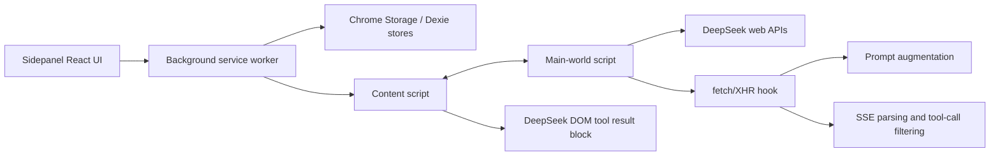

## Project Overview

## Preliminary Direction

Add MCP capability to DeepSeek++ so the Chrome extension can configure MCP servers, discover available tools, inject those tool schemas into DeepSeek prompts, execute model-requested MCP calls, and reuse the same capability from manual chats and automations.

## Current Architecture



DeepSeek++ is a WXT Chrome MV3 extension. The current architecture has three runtime layers:

- `entrypoints/background.ts`: extension service worker, message router, persistence coordinator, WebDAV sync handler, automation scheduler, and DeepSeek tab orchestration.
- `entrypoints/content.ts`: DeepSeek page content script, DOM integration, tool-call execution for built-in memory tools, result rendering, restoration, background image handling, and automation bridge.
- `entrypoints/main-world.content.ts`: main-world script that installs the network hook, mutates DeepSeek requests, parses streaming responses, and executes automation requests in page context.

The existing tool-call model is XML-over-prompt:

```text
Prompt injection -> DeepSeek streams XML tool tags -> main-world detects tags
-> content script executes tool action -> result block is rendered into DeepSeek UI
```

This is a good base for MCP, but current tool definitions are hardcoded around `memory_save`, `memory_update`, and `memory_delete`.

## Technology Stack

| Layer | Current | Target for MCP |
|:--|:--|:--|
| Language | TypeScript | TypeScript |
| Extension framework | WXT / Chrome MV3 | WXT / Chrome MV3 |
| UI | React 19 + Tailwind CSS 4 | Add MCP configuration page or tab |
| Persistence | Dexie for memories, Chrome Storage for most config | Chrome Storage for MCP server config; optional Dexie only if large logs are needed |
| Runtime bridges | `chrome.runtime`, `chrome.tabs`, `window.postMessage` | Reuse existing bridge with typed MCP messages |
| Tool protocol | Custom XML tags with JSON body | MCP tool schemas adapted into the same XML tag protocol |
| Build | `npm run compile`, `npm run build`, `npm run zip` | Same |

## Entry Points

- `entrypoints/background.ts`: best place for MCP server registry, connection lifecycle, permission checks, and request execution.
- `entrypoints/content.ts`: best place to route model-requested tool calls to background and render MCP execution results.
- `entrypoints/main-world.content.ts`: best place to receive tool schema state and keep prompt/SSE interception isolated from Chrome APIs.
- `core/interceptor/fetch-hook.ts`: current prompt augmentation and stream filtering; needs to become data-driven rather than relying on fixed `TOOL_NAMES`.
- `core/constants.ts`: currently owns hardcoded tool names, regex, and schemas; MCP should move dynamic tool metadata out of this file.
- `entrypoints/sidepanel/App.tsx`: tab shell where an MCP page can be added.
- `entrypoints/sidepanel/pages/SettingsPage.tsx`: existing settings pattern; MCP can either be a dedicated tab or a settings section.
- `core/automation/runner.ts`: automation path sends prompt directly through DeepSeek APIs; it currently does not run through the fetch-hook prompt injector in the same way as a user-typed chat, so MCP support for automations needs explicit design.

## Build & Run

```bash
npm install
npm run compile
npm run build
npm run dev
npm run zip
```

There is no dedicated unit test runner in `package.json`; verification currently depends on TypeScript compile, WXT build, and browser/manual extension checks.

## External Integrations

- DeepSeek web APIs:
  - `/api/v0/chat/completion`
  - `/api/v0/chat/history_messages`
  - `/api/v0/chat/create_pow_challenge`
  - `/api/v0/chat_session/create`
- Chrome extension APIs:
  - `sidePanel`, `storage`, `alarms`, `tabs`, `permissions`
- WebDAV sync:
  - user-configured remote storage for memories, skills, and presets
- Future MCP:
  - browser extension cannot spawn arbitrary local MCP stdio processes by itself
  - practical browser-compatible first targets are HTTP/SSE/Streamable HTTP MCP endpoints, or a companion local bridge exposed over HTTP/WebSocket/native messaging

## Detected Tracking Mode

`GITHUB_STANDARD`

The GitHub CLI is available, authenticated, and can access Issues. Project board support is not available because the token lacks `project` scope.
