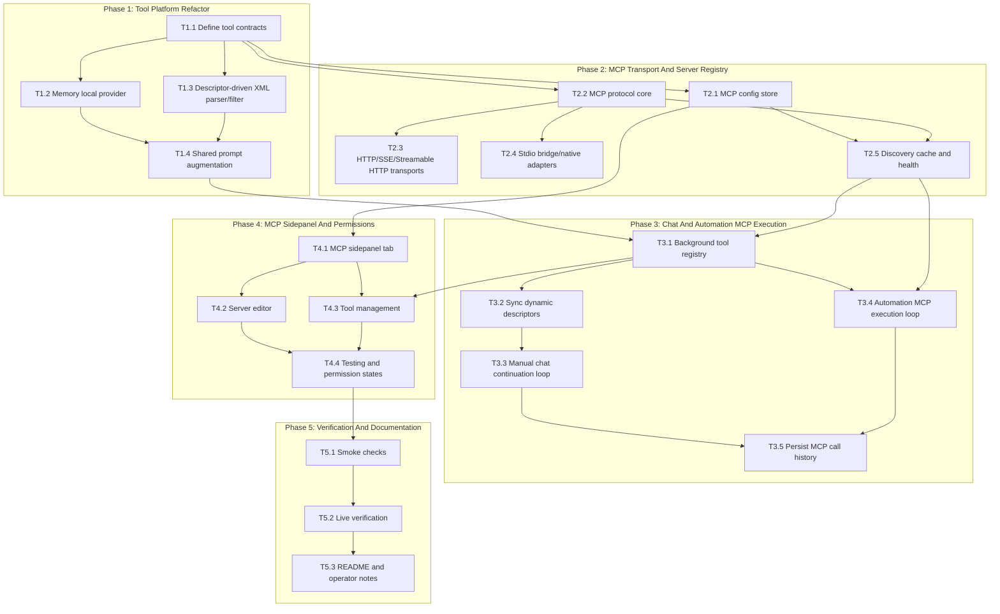

## Task Dependency Graph

```mermaid
graph TD
  subgraph P1["Phase 1: Tool Platform Refactor"]
    T1_1["T1.1 Define tool contracts"]
    T1_2["T1.2 Memory local provider"]
    T1_3["T1.3 Descriptor-driven XML parser/filter"]
    T1_4["T1.4 Shared prompt augmentation"]
    T1_1 --> T1_2
    T1_1 --> T1_3
    T1_2 --> T1_4
    T1_3 --> T1_4
  end

  subgraph P2["Phase 2: MCP Transport And Server Registry"]
    T2_1["T2.1 MCP config store"]
    T2_2["T2.2 MCP protocol core"]
    T2_3["T2.3 HTTP/SSE/Streamable HTTP transports"]
    T2_4["T2.4 Stdio bridge/native adapters"]
    T2_5["T2.5 Discovery cache and health"]
    T2_1 --> T2_5
    T2_2 --> T2_3
    T2_2 --> T2_4
    T2_2 --> T2_5
  end

  subgraph P3["Phase 3: Chat And Automation MCP Execution"]
    T3_1["T3.1 Background tool registry"]
    T3_2["T3.2 Sync dynamic descriptors"]
    T3_3["T3.3 Manual chat continuation loop"]
    T3_4["T3.4 Automation MCP execution loop"]
    T3_5["T3.5 Persist MCP call history"]
    T3_1 --> T3_2
    T3_2 --> T3_3
    T3_1 --> T3_4
    T3_3 --> T3_5
    T3_4 --> T3_5
  end

  subgraph P4["Phase 4: MCP Sidepanel And Permissions"]
    T4_1["T4.1 MCP sidepanel tab"]
    T4_2["T4.2 Server editor"]
    T4_3["T4.3 Tool management"]
    T4_4["T4.4 Testing and permission states"]
    T4_1 --> T4_2
    T4_1 --> T4_3
    T4_2 --> T4_4
    T4_3 --> T4_4
  end

  subgraph P5["Phase 5: Verification And Documentation"]
    T5_1["T5.1 Smoke checks"]
    T5_2["T5.2 Live verification"]
    T5_3["T5.3 README and operator notes"]
    T5_1 --> T5_2
    T5_2 --> T5_3
  end

  T1_1 --> T2_1
  T1_1 --> T2_2
  T1_4 --> T3_1
  T2_5 --> T3_1
  T2_5 --> T3_4
  T2_1 --> T4_1
  T3_1 --> T4_3
  T4_4 --> T5_1
```
