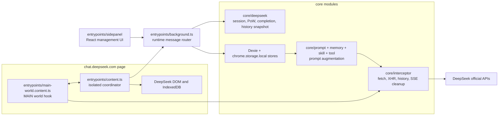
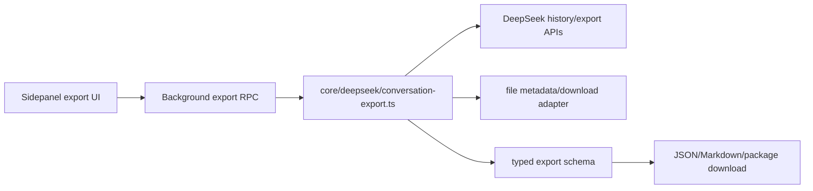

# Project Overview

## Preliminary Direction

Add a user-facing export feature for DeepSeek++ so users can export their own conversation records from the official DeepSeek web app, including file and attachment references where available.

This is a new spec-driven feature. No prior `docs/progress/MASTER.md` existed when this analysis started.

## Current Architecture

DeepSeek++ is a WXT browser extension that enhances `chat.deepseek.com` through a main-world fetch/XHR/IndexedDB hook, an isolated-world coordinator, a background runtime message router, and a React side panel.

For the export feature, the maintainable target direction is:

The key architectural rule is that `fetch-hook.ts` and `content.ts` should not become the export engine. They may expose current-page context, but export fetching, normalization, validation, and packaging should live behind an explicit adapter and schema.

## Technology Stack

| Layer | Current | Target for this feature |
|:--|:--|:--|
| Language | TypeScript | TypeScript |
| Extension framework | WXT MV3 | WXT MV3 |
| UI | React 19 side panel + Tailwind CSS | Existing side panel patterns |
| Build tool | WXT/Vite | Existing WXT scripts |
| Browser APIs | Chrome extension APIs, `chrome.storage.local`, IndexedDB, Native Messaging | Background RPC, existing host permission, optional permission only if attachment hosts require it |
| Database/storage | Dexie `DeepSeekPP.memories`, feature-specific `chrome.storage.local` stores | Prefer on-demand export with no silent conversation archive; store only explicit export state if needed |
| Test framework | Vitest + jsdom | Vitest fixture tests for export schema/normalization plus compile/build checks |
| Deployment | Chrome/Edge/Firefox packages via WXT | Existing multi-browser build and manifest policy checks |

## Entry Points

| Area | Files | Current role | Export relevance |
|:--|:--|:--|:--|
| Extension manifest | `wxt.config.ts` | Generates permissions, host permissions, side panel config, web resources. | Existing `chat.deepseek.com` host permission supports same-origin DeepSeek API calls; `downloads` is not present. |
| Main-world hook | `entrypoints/main-world.content.ts` | Installs fetch/XHR/IndexedDB hook at `document_start`, bridges events to isolated content. | Should not perform export; can provide page-side context if needed. |
| Interceptor | `core/interceptor/fetch-hook.ts` | Intercepts completion/regenerate/history, captures headers, cleans visible stream/history/cache, reports response metadata. | Captures `chatSessionId`, message ids, `refFileIds`; current history path is cleaned, not a raw export source. |
| DeepSeek adapter | `core/deepseek/adapter.ts` | Shared transport for session creation, PoW, completion streaming, history snapshot, header/token handling. | Best place to extend with explicit history/export/file adapters, while avoiding background `location.origin` assumptions. |
| Background | `entrypoints/background.ts` | Runtime message switch for memory, skill, MCP, sync, automation, sidepanel chat, permission requests. | Should expose a small typed export RPC and avoid expanding untyped message sprawl. |
| Side panel | `entrypoints/sidepanel/App.tsx`, `pages/SettingsPage.tsx` | React tabs and settings/data management UI. | Existing memory export is a Blob JSON download pattern; official conversation export needs separate UI/state. |
| Schema/validation | `core/sync/schema.ts`, `core/types.ts` | Runtime validators for sync data; shared types and partial message union. | Export needs its own serializable schema and validator. |
| Privacy/store docs | `docs/chrome-web-store/privacy-policy.md`, `submission.md`, `listing.md` | Declares handled data and permissions. | Must be updated if official conversation export or attachment download is shipped. |

## Build & Run

Relevant existing commands:

| Command | Purpose |
|:--|:--|
| `npm run dev` | Start WXT dev mode. |
| `npm run compile` | Type-check with `tsc --noEmit`. |
| `npm test` | Run Vitest tests under `tests/**/*.test.ts`. |
| `npm run build:chrome` | Build Chrome target. |
| `npm run build:all` | Build Chrome, Edge, and Firefox targets. |
| `npm run verify:manifest-policy` | Verify manifest permissions and Chrome Web Store policy docs stay aligned. |
| `npm run ci:quality` | Full quality gate. |

During Phase 1, `gh` pre-flight detected `GITHUB_STANDARD`: GitHub CLI and issue access are available, but Project board access is not. If planning continues in GitHub mode, the workflow should create Issues and Milestones, but no Project board.

## External Integrations

| Integration | Current status | Export implication |
|:--|:--|:--|
| DeepSeek official web app | Extension runs on `*://chat.deepseek.com/*`. | Primary source for conversation export. |
| DeepSeek completion API | `https://chat.deepseek.com/api/v0/chat/completion` is the known completion path. | Existing adapter should not be overloaded with export details; add dedicated export functions. |
| DeepSeek history API | `/api/v0/chat/history_messages` is currently used for snapshot/cleanup. | Existing hook mutates visible history responses; export must define raw vs sanitized explicitly. |
| DeepSeek files/attachments | Current code only tracks `ref_file_ids`; no file metadata/download adapter exists. | Need logged-in network verification of official file metadata/download endpoints before promising file contents. |
| WebDAV | User-configured sync for extension data. | Do not mix official conversation export into WebDAV sync unless separately requested. |
| MCP/native host | User-configured tool execution. | Not part of conversation export except tool result text already present in conversations. |

## Live Endpoint Verification Note

A lightweight unauthenticated request to `https://chat.deepseek.com/` returned HTTP 429 from the upstream protection layer, so Phase 1 did not verify current official export/file endpoint contracts. Any plan that includes file bodies must start with logged-in, browser-context verification of the official endpoints and payload shapes.
