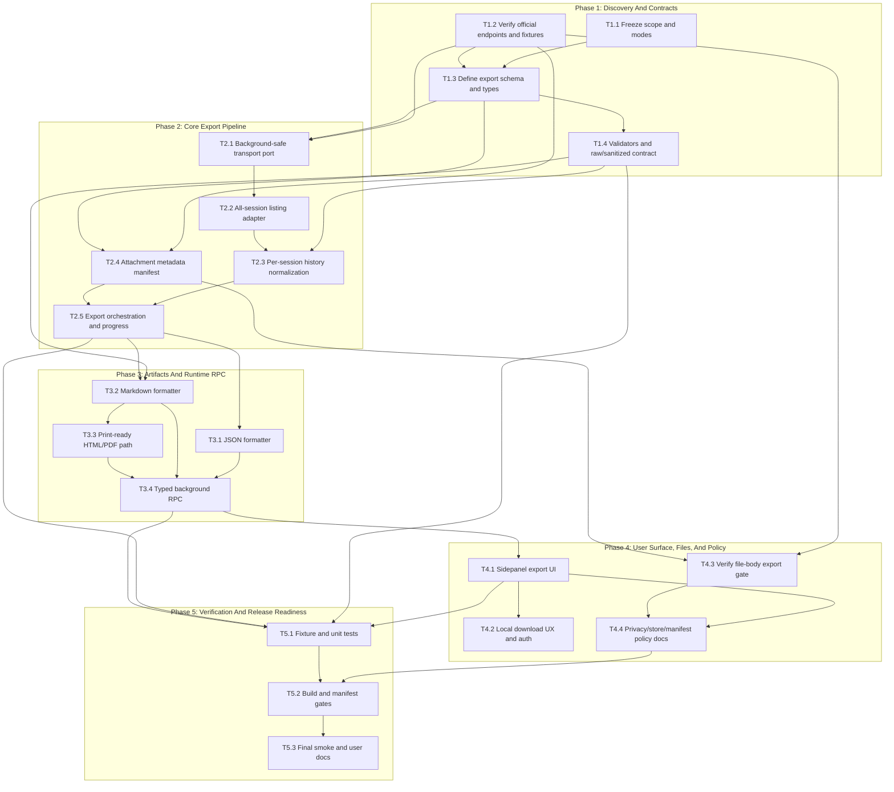
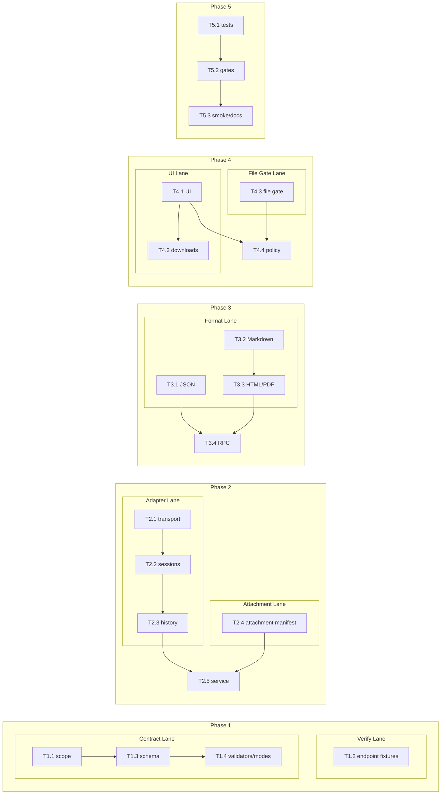

# Task Dependency Graph

```mermaid
graph TD
    subgraph Phase1["Phase 1: Discovery And Contracts"]
        T1_1["T1.1 Freeze scope and modes"]
        T1_2["T1.2 Verify official endpoints and fixtures"]
        T1_3["T1.3 Define export schema and types"]
        T1_4["T1.4 Validators and raw/sanitized contract"]
        T1_1 --> T1_3
        T1_2 --> T1_3
        T1_3 --> T1_4
    end

    subgraph Phase2["Phase 2: Core Export Pipeline"]
        T2_1["T2.1 Background-safe transport port"]
        T2_2["T2.2 All-session listing adapter"]
        T2_3["T2.3 Per-session history normalization"]
        T2_4["T2.4 Attachment metadata manifest"]
        T2_5["T2.5 Export orchestration and progress"]
        T1_2 --> T2_1
        T1_3 --> T2_1
        T2_1 --> T2_2
        T1_4 --> T2_3
        T2_2 --> T2_3
        T1_2 --> T2_4
        T1_3 --> T2_4
        T2_3 --> T2_5
        T2_4 --> T2_5
    end

    subgraph Phase3["Phase 3: Artifacts And Runtime RPC"]
        T3_1["T3.1 JSON formatter"]
        T3_2["T3.2 Markdown formatter"]
        T3_3["T3.3 Print-ready HTML/PDF path"]
        T3_4["T3.4 Typed background RPC"]
        T2_5 --> T3_1
        T1_4 --> T3_2
        T2_5 --> T3_2
        T3_2 --> T3_3
        T3_1 --> T3_4
        T3_2 --> T3_4
        T3_3 --> T3_4
    end

    subgraph Phase4["Phase 4: User Surface, Files, And Policy"]
        T4_1["T4.1 Sidepanel export UI"]
        T4_2["T4.2 Local download UX and auth"]
        T4_3["T4.3 Verify file-body export gate"]
        T4_4["T4.4 Privacy/store/manifest policy docs"]
        T3_4 --> T4_1
        T4_1 --> T4_2
        T1_2 --> T4_3
        T2_4 --> T4_3
        T4_1 --> T4_4
        T4_3 --> T4_4
    end

    subgraph Phase5["Phase 5: Verification And Release Readiness"]
        T5_1["T5.1 Fixture and unit tests"]
        T5_2["T5.2 Build and manifest gates"]
        T5_3["T5.3 Final smoke and user docs"]
        T1_4 --> T5_1
        T2_5 --> T5_1
        T3_4 --> T5_1
        T4_1 --> T5_1
        T4_4 --> T5_2
        T5_1 --> T5_2
        T5_2 --> T5_3
    end
```

## Parallel Lane View

```mermaid
graph LR
    subgraph P1["Phase 1"]
        subgraph P1A["Verify Lane"]
            T1_2b["T1.2 endpoint fixtures"]
        end
        subgraph P1B["Contract Lane"]
            T1_1b["T1.1 scope"] --> T1_3b["T1.3 schema"] --> T1_4b["T1.4 validators/modes"]
        end
    end

    subgraph P2["Phase 2"]
        subgraph P2A["Adapter Lane"]
            T2_1b["T2.1 transport"] --> T2_2b["T2.2 sessions"] --> T2_3b["T2.3 history"]
        end
        subgraph P2B["Attachment Lane"]
            T2_4b["T2.4 attachment manifest"]
        end
        T2_3b --> T2_5b["T2.5 service"]
        T2_4b --> T2_5b
    end

    subgraph P3["Phase 3"]
        subgraph P3A["Format Lane"]
            T3_1b["T3.1 JSON"]
            T3_2b["T3.2 Markdown"] --> T3_3b["T3.3 HTML/PDF"]
        end
        T3_1b --> T3_4b["T3.4 RPC"]
        T3_3b --> T3_4b
    end

    subgraph P4["Phase 4"]
        subgraph P4A["UI Lane"]
            T4_1b["T4.1 UI"] --> T4_2b["T4.2 downloads"]
        end
        subgraph P4B["File Gate Lane"]
            T4_3b["T4.3 file gate"]
        end
        T4_1b --> T4_4b["T4.4 policy"]
        T4_3b --> T4_4b
    end

    subgraph P5["Phase 5"]
        T5_1b["T5.1 tests"] --> T5_2b["T5.2 gates"] --> T5_3b["T5.3 smoke/docs"]
    end
```
