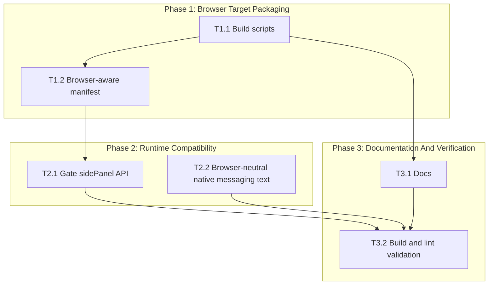

## Dependency Graph

```mermaid
flowchart TD
  subgraph "Phase 1: Browser Target Packaging"
    T11["T1.1 Build scripts"]
    T12["T1.2 Browser-aware manifest"]
  end

  subgraph "Phase 2: Runtime Compatibility"
    T21["T2.1 Gate sidePanel API"]
    T22["T2.2 Browser-neutral native messaging text"]
  end

  subgraph "Phase 3: Documentation And Verification"
    T31["T3.1 Docs"]
    T32["T3.2 Build and lint validation"]
  end

  T11 --> T12
  T12 --> T21
  T11 --> T31
  T21 --> T32
  T22 --> T32
  T31 --> T32
```
